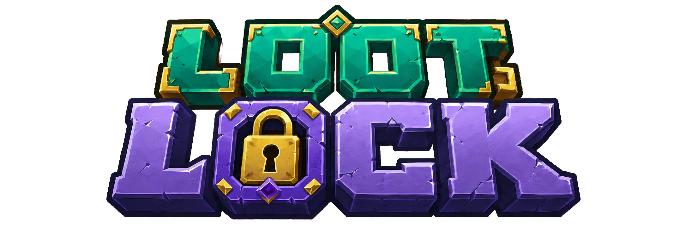
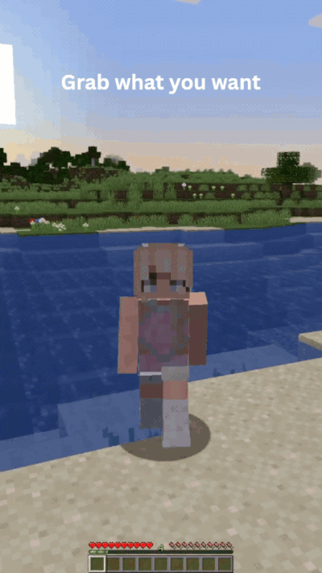
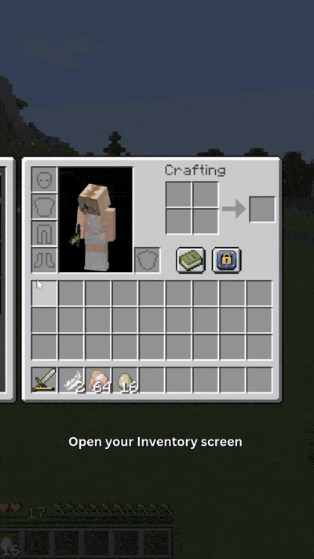

**Your loot, your rules.** Loot Lock is an open-source Fabric mod for per-player ground-item filtering. Server-authoritative, multiplayer-safe, zero junk.

Stop letting your inventory turn into a graveyard of rotten flesh and wheat seeds. Loot Lock lets every player on the server decide exactly which ground items they want to pick up, and ignores everything else. No more inventory tetris after every cave run. No more shift-clicking junk into hoppers for ten minutes after a raid.

## Built For

**Survival players** tired of picking up eggs while breeding chickens or wheat seeds while clearing grass.

**Mob farmers** running an iron golem grinder who only want ingots, not the 47 poppies dropped along the way.

**Redstone engineers** building in survival who want one profile that grabs only redstone dust, repeaters, and torches so circuit work stays clean.

**SMP raid teams** clearing pillager outposts where one player hoards every crossbow and the other wants nothing but emeralds. Both can have their way, on the same world, at the same time.

**Modpack authors** who need a clean, sane way to give players inventory control without bolting on five separate utility mods.

**Anyone who has ever yelled** at their screen because they ran over a pile of seeds while trying to grab netherite.

## What You Get

### Filtering
- **Per-player profiles** with independent rules, so your filter does not affect anyone else's gameplay.
- **Allowlist or denylist mode** per profile. Pick exactly what to grab, or pick exactly what to skip.
- **Multiple profiles per player** for fast switching. Mining loadout, building loadout, farming loadout. Swap in one click or one keypress.
- **Leave on ground or delete** rejected items. Delete mode includes safety confirmations and an operator opt-out.

### In-game UI
- **Docked panel** that slides out beside your inventory, no separate full-screen menu detour.
- **Rules tab** with live item search, multi-select, drag-and-drop add, and a gold-border drop target with a soft flash so you know the drop landed.
- **Settings tab** for HUD toasts, safety confirmations, and a built-in keybind cheatsheet.
- **Inline profile rename** by clicking the profile pill, plus one-click cycle arrows and a colour chip per profile.

### Feedback
- **Blocked-item toast** that briefly tells you which item was filtered out (toggleable).
- **Profile-switch toast** so you know which loadout you just swapped to (toggleable).
- **Toggle toast** when Loot Lock is turned on or off (toggleable).

### Multiplayer
- **Server-authoritative** state with proper edit synchronisation. No desync. No cheaty client overrides.
- **Works for vanilla clients too.** Players without the mod installed still benefit if a server operator manages their rules through commands.
- **Full command coverage** alongside the UI, manage rules however you prefer.

## Quick Start

1. Drop Loot Lock and Fabric API into your `mods` folder.
2. Launch the game, join your world, open your inventory.
3. Click the small Loot Lock button beside the recipe-book button. The docked panel opens alongside the inventory.
4. Open the **Rules** tab, type to search items, pick a filter mode, hit **Add selected**, and walk over a few drops to verify.

That is the whole setup. No config file editing required.

### Shortcuts

Inside the Rules tab:

- **Shift click** a search result to select a range.
- **Ctrl click** (or **Cmd click** on macOS) to add or remove individual rows.
- **Double-click** any row to add it immediately.
- **Alt click** any inventory slot to add that item directly without opening the search.
- **Drag a stack** onto the panel to drop it straight into your rules.
- **Drag a stack** onto the closed Loot Lock button to add it without opening the panel.
- **Clear all** wipes the active profile, **Clear search** appears in its place while searching.
- **Search starting with `#`** scopes results to item tags (`#flowers`, `#seeds`, `#minecraft:wool`). Add a tag row the same way you add an item row, and it expands to match every item the tag covers.

### Pro Tips

- Bind **Cycle Loot Profile** to a side mouse button. Swap between mining, building, and farming loadouts mid-action without opening anything.
- Use **denylist mode** for general play with a short reject list (eggs, seeds, rotten flesh), and **allowlist mode** for focused tasks like mining where you want only the good stuff.
- Pair a delete-mode profile with a mob farm so your collection chests never fill with junk drops.
- Operators can pre-stage profiles for new players with `/lootlock` commands before they ever log in.

## Controls

Loot Lock ships with two keybinds, both unbound by default. Set them in `Controls > Loot Lock`:

- **Toggle Loot Lock** flips the whole-mod enable state, identical to clicking the Player switch on the docked panel.
- **Cycle Loot Profile** swaps to your next saved profile in one keypress.

## Commands

All commands are rooted at `/lootlock`. The in-game UI covers everything below, but commands are the only path if you do not have the client mod installed.

### Common

| Command | What it does |
| --- | --- |
| `/lootlock` | Prints quick command help. |
| `/lootlock status` | Shows active profile, enabled state, mode, action, and rule count. |
| `/lootlock enable` | Enables Loot Lock across every profile you own (whole-mod toggle). |
| `/lootlock disable` | Disables Loot Lock across every profile you own (whole-mod toggle). |
| `/lootlock profile list` | Lists your profiles and marks the active one. |
| `/lootlock profile activate <name>` | Activates a profile by name, then shows status. |

### Profiles and rules

| Command | What it does | Notes |
| --- | --- | --- |
| `/lootlock profile create <name>` | Creates a new profile with default settings. | Names are trimmed and must be 1 to 32 chars. Max 9 profiles per player. |
| `/lootlock profile delete <name>` | Deletes a profile by name. | Cannot delete your last profile. |
| `/lootlock profile export <name>` | Encodes the named profile as a clickable, copy-to-clipboard share code. | See the Share profiles section below. |
| `/lootlock profile import <code>` | Decodes a `ll1.`-prefixed share code and creates a new profile from it. | Name collisions auto-suffix with `(2)`, `(3)`, etc. |
| `/lootlock mode denylist` | Sets active profile filter mode to denylist. | |
| `/lootlock mode allowlist` | Sets active profile filter mode to allowlist. | |
| `/lootlock action leave` | Sets rejected-item behaviour to leave drops on the ground. | |
| `/lootlock action delete` | Shows safety warning and confirmation instructions for delete mode. | |
| `/lootlock action delete confirm` | Sets rejected-item behaviour to permanently delete rejected drops. | Blocked if server policy disallows delete mode. |
| `/lootlock rule add <namespace:item>` | Adds an item rule to the active profile. | Item id must exist. |
| `/lootlock rule add tag <namespace:tag_path>` | Adds an item tag rule to the active profile, matching every item the tag resolves to. | Saves even if the tag is not currently loaded; resolves later via datapack reload. |
| `/lootlock rule remove <namespace:item>` | Removes an item rule from the active profile. | |
| `/lootlock rule remove tag <namespace:tag_path>` | Removes a tag rule from the active profile. | |
| `/lootlock rule list` | Lists rules in the active profile. | |
| `/lootlock rule clear` | Shows confirmation hint before clearing rules. | |
| `/lootlock rule clear confirm` | Removes all rules from the active profile. | |

### Operator

Requires operator permission level `2`.

Server policy lives under `/lootlock policy`. Every command in the Common and Profiles and rules tables also has an operator form prefixed with `/lootlock player <target>` that runs the same subcommand against another player's data instead of the caller's.

| Command | What it does |
| --- | --- |
| `/lootlock policy` | Shows current server policy values. |
| `/lootlock policy allowDeleteRejectedItems true` | Allows players to use delete mode for rejected items. |
| `/lootlock policy allowDeleteRejectedItems false` | Blocks delete mode and forces leave-mode behaviour. |
| `/lootlock player <target> <subcommand>` | Runs any self-targeted subcommand against `<target>` instead of the caller. |

`<target>` accepts an online player name (tab-completes), an offline name the server has cached, or a raw UUID literal for pre-staging a profile for a player who has never joined. Online targets receive an authoritative sync after every mutation so their client reflects the change without rejoining. Offline edits persist through the debounced save path keyed by UUID and survive restarts.

## FAQ

**Does it work on vanilla clients?**
Yes. The server runs all filtering. A vanilla client cannot open the docked UI, but an operator can manage that player's profiles using `/lootlock` commands and rules apply normally on pickup.

**Does it work with modded items?**
Yes. Rules are stored as item ids (`namespace:item`), so anything Minecraft can identify, Loot Lock can filter.

**What about performance?**
Filtering runs only on the server's pickup tick, against a hash-keyed rule set per player. Overhead per pickup is constant-time and negligible compared to vanilla pickup logic.

**Do I need to edit any config files?**
No. Everything is configured in-game by the player, or by operator commands on the server. Client-side toast preferences persist automatically.

**Where is data stored?**
Profile data is server-authoritative and saved per player UUID alongside other world data, so it survives across sessions and rejoins.

## Compatibility

- **Minecraft:** `1.20.1`
- **Loader:** Fabric `0.19.2+`
- **Fabric API:** `0.92.9+1.20.1` minimum
- **Java:** `17+` (Java 21 supported and recommended)
- **Environments:** dedicated server and integrated server, with or without client mod installed

## Dependencies

| Dependency | Version | Required | Purpose |
| --- | --- | --- | --- |
| Fabric Loader | `>=0.19.2` | Yes | Mod loader |
| Fabric API | `>=0.92.9+1.20.1` | Yes | Fabric hooks and APIs |
| Mod Menu | `>=7.2.2` | No | Opens Loot Lock client preferences from the mod list. Profiles, rules, and server policy are edited in-game by opening the Loot Lock panel from your inventory |

## Permissions

Operator permission level `2` is required for the `policy` command path and for managing other players' profiles. Players without operator permissions can still fully manage their own profile through the UI or commands.

## Share profiles

Profiles can be exported as a short pasteable share code and imported back into any world with Loot Lock installed.

Run `/lootlock profile export <name>` to get back a clickable string like `ll1.eJyrViouSU3MS1ezUjI0Mlay8suvtFKK1FFKzEsBigEAyiYItQ`. Click the code in chat and Minecraft copies it to your clipboard. Paste it into Discord, a Reddit comment, a modpack readme, or anywhere else.

You can also export and import without leaving the inventory. Open the Loot Lock panel, click the profile pill to expand the dropdown, hit the `E` mini button on any profile row to copy that profile's share code straight to your clipboard, or click `Import from code` under `+ New profile` to open a paste prompt that accepts a `ll1.` code and adds it as a new profile.

To bring a code in via chat, run `/lootlock profile import <code>`. The decoder validates the prefix, payload, and every field before creating a new profile. If the imported name collides with one you already own, the new profile is suffixed with ` (2)`, ` (3)`, and so on. Errors return a clear message rather than crashing.

What does and does not travel inside a code:

- **Travels:** profile name, filter mode, rejected-item action, and the full ordered list of rules (item ids and tag entries prefixed with `#`).
- **Does not travel:** profile colour, enabled state, profile id. The importer mints a fresh id and leaves color choice to the importer.

Codes are public by definition. Do not encode anything you would not paste into a public channel.

## Contributing translations

Every player-visible string is wired through Minecraft's translation pipeline. To ship a new locale, copy `src/client/resources/assets/loot-lock/lang/en_us.json` to a new file named after your locale code (for example `de_de.json`, `es_es.json`, `ja_jp.json`) and translate the values. Keys must stay byte-for-byte identical, and `%s` placeholders must remain in the translated string. Submit your file as a PR. The build's translation-key coverage test enforces that every key referenced in code has a value in `en_us.json`, so the English bundle stays the source of truth for what needs translating.

## Open Source

Loot Lock is open source under the MIT license.

If Loot Lock saved your sanity on a long survival run, a star on GitHub or a coffee on Ko-fi goes a long way.
